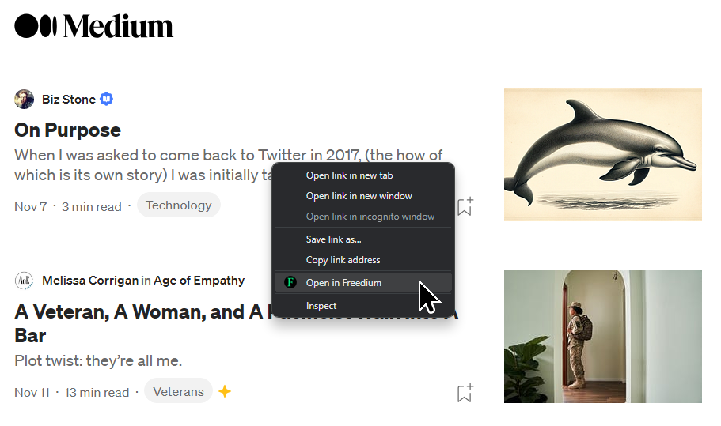

# freedium-browser-extension

A browser extension to quickly open Medium articles in [Freedium](https://freedium-mirror.cfd) to bypass paywall.

Simply right click on any Medium link, or right click on anywhere in a Medium article page, and then click on "Open in Freedium".

You can also go to the Options page and add custom patterns in addition to "medium.com".

**Chrome Web Store**: ~https://chrome.google.com/webstore/detail/open-in-freedium/giibjnmcmkglpdichdiabecdkeefknak~ (removed by Google as it violates store policy)

**Firefox Add-on**: https://addons.mozilla.org/en-GB/firefox/addon/open-in-freedium/

---

### Getting it to work in Chrome/Edge

Because this is not available in the Chrome Web Store any more, you need to follow these steps to load the extension:

1. Clone this repo
1. Run the `build.bat` (Windows) or the `build.sh` (Linux) script
1. Go to the Extensions page in Chrome `chrome://extensions` (or equivalent page in Edge)
1. Enable "Developer mode"
1. Click the "Load unpacked" button
1. Point to the `chrome` directory created by the aforementioned script
